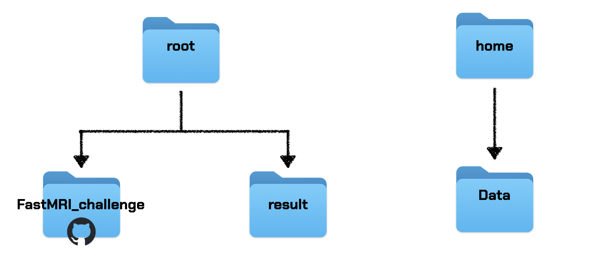
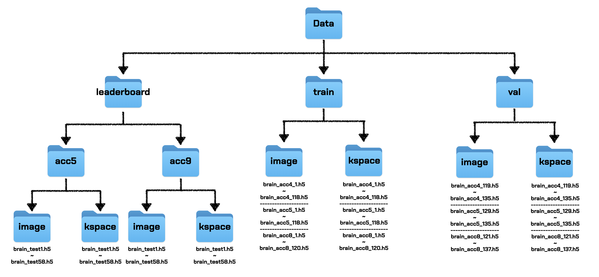

# 2024 baby varnet
2024 SNU FastMRI challenge

## 1. 폴더 계층

### 폴더의 전체 구조

* FastMRI_challenge, Data, result 폴더가 위의 구조대로 설정되어 있어야 default argument를 활용할 수 있습니다.
* 본 github repository는 FastMRI_challenge 폴더입니다.
* Data 폴더는 MRI data 파일을 담고 있으며 아래에 상세 구조를 첨부하겠습니다.
* result 폴더는 학습한 모델의 weights을 기록하고 validation, leaderboard dataset의 reconstruction image를 저장하는데 활용되며 아래에 상세 구조를 첨부하겠습니다.

### Data 폴더의 구조

* train, val:
    * train, val 폴더는 각각 모델을 학습(train), 검증(validation)하는데 사용하며 각각 image, kspace 폴더로 나뉩니다.
    * 참가자들은 generalization과 representation의 trade-off를 고려하여 train, validation의 set을 자유로이 나눌 수 있습니다.
    * image와 kspace 폴더에 들어있는 파일의 형식은 다음과 같습니다: brain_{mask 형식}_{순번}.h5
    * ex) brain_acc8_3.h5  
    * {mask 형식}은 "acc4", "acc5", "acc8" 중 하나입니다.
    * "acc4"와 "acc5"의 경우 {순번}은 1 ~ 118, "acc8"의 경우 {순번}은 1 ~ 120 사이의 숫자입니다. 
* leaderboard:
   * **leaderboard는 성능 평가를 위해 활용하는 dataset이므로 절대로 학습 과정에 활용하면 안됩니다.**
   * leaderboard 폴더는 mask 형식에 따라서 acc5과 acc9 폴더로 나뉩니다.
   * acc5과 acc9 폴더는 각각 image, kspace 폴더로 나뉩니다.
   * image와 kspace 폴더에 들어있는 파일의 형식은 다음과 같습니다: brain_test_{순번}.h5
   * {순번}은 1 ~ 58 사이의 숫자입니다. 

### result 폴더의 구조
* result 폴더는 모델의 이름에 따라서 여러 폴더로 나뉠 수 있습니다.
* test_Unet (혹은 test_Varnet) 폴더는 아래 3개의 폴더로 구성되어 있습니다.
  * checkpoints - `model.pt`, `best_model.pt`의 정보가 있습니다. 모델의 weights 정보를 담고 있습니다.
  * reconstructions_val - validation dataset의 reconstruction을 저장합니다. brain_{mask 형식}_{순번}.h5 형식입니다. (```train.py``` 참고)
  * reconstructions_leaderboard - leaderboard dataset의 reconstruction을 저장합니다. brain_test_{순번}.h5 형식입니다. (```reconstruct.py``` 참고)
  * val_loss_log.npy - epoch별로 validation loss를 기록합니다. (```train.py``` 참고)

## 2. 폴더 정보

```bash
├── .gitignore
├── reconstruct.py
├── leaderboard_eval.py
├── README.md
├── train.py
└── utils
│   ├── common
│   │   ├── loss_function.py
│   │   └── utils.py
│   ├── data
│   │   ├── load_data.py
│   │   └── transforms.py
│   ├── learning
│   │   ├── test_part.py
│   │   └── train_part.py
│   └── model
│       └── varnet.py
└── result
```

## 3. Before you start
* ```train.py```, ```reconstruct.py```, ```leaderboard_eval.py``` 순으로 코드를 실행하면 됩니다.
* ```train.py```
   * train/validation을 진행하고 학습한 model의 결과를 result 폴더에 저장합니다.
   * 가장 성능이 좋은 모델의 weights을 ```best_model.pt```으로 저장합니다. 
* ```reconstruct.py```
   * ```train.py```으로 학습한 ```best_model.pt```을 활용해 leader_board dataset을 reconstruction하고 그 결과를 result 폴더에 저장합니다.
   * acceleration 종류와 관계없이 하나의 파이프라인을 통해 전부 reconstruction을 실행합니다.
   * Inference Time이 대회 GPU 기준으로 3000초를 초과할 경우 Total SSIM을 기록할 수 없습니다. 실제 Evaluation 때 조교가 확인할 예정이며, inference time은 과도하게 모델이 크지 않는다면 걱정하실 필요 없습니다.
* ```leaderboard_eval.py```
   * ```evaluation.py```을 활용해 생성한 reconstruction의 SSIM을 측정합니다.
   * SSIM (public): 기존에 공개된 acc4, acc5, acc8 중 하나인 acc5 데이터의 reconstruction의 SSIM을 측정합니다.
   * SSIM (private): 기존에 공개되지 않은 acc9 데이터의 reconstruction의 SSIM을 측정합니다.
   * Total SSIM은 SSIM (public), SSIM (private)의 평균으로 계산됩니다. Report할 때 이 값을 제출하시면 됩니다.

## 4. How to set?
```bash
pip3 install numpy
pip3 install h5py
pip3 install scikit-image
```

## 5. How to train?
```bash
python train.py // sh train.sh
```
- validation할 때, reconstruction data를 ```result/reconstructions_val/```에 저장합니다.
- epoch 별로 validation dataset에 대한 loss를 기록합니다.
- sh train.sh를 사용하여도 같은 결과를 얻으실 수 있습니다. Hyperparameter를 쉽게 조작할 수 있습니다.
- seed 고정을 하여 이후에 Re-training하였을 때 같은 결과가 나와야 합니다.

## 6. How to reconstruct?
```bash
python reconstruct.py // sh reconstruct.sh
```
- leaderboard 평가를 위한 reconstruction data를 ```result/reconstructions_leaderboard```에 저장합니다.

## 7. How to evaluate LeaderBoard Dataset?
```bash
python leaderboard_eval.py // sh leaderboard_eval.sh
```
- leaderboard 순위 경쟁을 위한 SSIM 값을 한번에 구합니다.
- Total SSIM을 제출합니다.

## 8. What to submit!
- github repository(코드 실행 방법 readme에 상세 기록)
- loss 그래프 혹은 기록
- 모델 weight file
- 모델 설명 ppt
