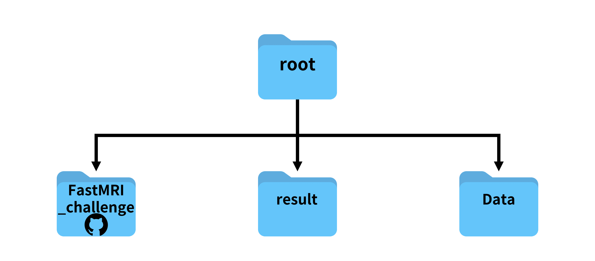
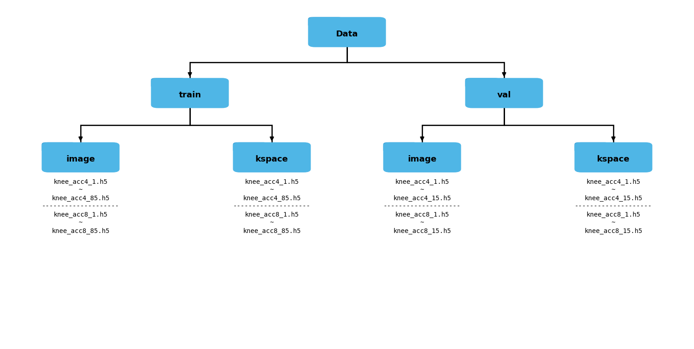

# 2026 baby varnet (annotation)
2026 SNU FastMRI challenge — knee annotation track

* 본 baseline은 **E2E-VarNet** 구조입니다. (baby unet 대비 kspace + sensitivity map을 직접 다룹니다.)
* 본 대회는 **knee 데이터만** 사용합니다.
* 복원 품질은 두 가지 SSIM으로 평가합니다.
  * **SSIM_full**: foreground mask 내부 영역에 대해 평균한 SSIM
  * **SSIM_bbox**: fastMRI+ 병변 bounding-box 영역 안에서만 계산한 SSIM

## 1. 폴더 계층

### 폴더의 전체 구조

* `FastMRI_challenge`, `Data`, `result` 폴더가 위의 구조대로 설정되어 있어야 default argument를 활용할 수 있습니다.
* 본 github repository는 `FastMRI_challenge` 폴더입니다.
* `Data` 폴더는 MRI data 파일을 담고 있으며 아래에 상세 구조를 첨부하겠습니다.
* `result` 폴더는 학습한 모델의 weights을 기록하고 validation, leaderboard dataset의 reconstruction image를 저장하는데 활용되며, 아래에 상세 구조를 첨부하겠습니다.

### Data 폴더의 구조

* train, val:
    * train, val 폴더는 각각 모델을 학습(train), 검증(validation)하는데 사용하며 각각 image, kspace 폴더로 나뉩니다.
    * 참가자들은 generalization과 representation의 trade-off를 고려하여 train, validation의 set을 자유로이 나눌 수 있습니다.
    * image와 kspace 폴더에 들어있는 파일의 형식은 다음과 같습니다: knee\_{mask 형식}\_{순번}.h5
    * ex) knee_acc4_10.h5, knee_acc8_3.h5
    * {mask 형식}은 "acc4", "acc8" 중 하나입니다.
    * train은 "acc4", "acc8" 각각 {순번} 1 ~ 85, val은 각각 1 ~ 15 입니다.
* leaderboard:
   * **leaderboard는 성능 평가를 위해 활용하는 dataset이므로 절대로 학습 과정에 활용하면 안됩니다.** (제출 코드는 seed 고정 재학습으로 재현 검증합니다.)
   * leaderboard 폴더는 mask 형식에 따라서 acc4과 acc8 폴더로 나뉩니다.
   * acc4과 acc8 폴더는 각각 image, kspace 폴더로 나뉩니다.
   * image와 kspace 폴더에 들어있는 파일의 형식은 다음과 같습니다: knee\_test{순번}.h5
   * {순번}은 acc4 / acc8 각각 1 ~ 29 사이의 숫자입니다.

### Annotation
* fastMRI+ knee 병변 bounding box는 각 image h5의 `attrs['annotations']`에 JSON으로 저장되어 있습니다.
* 형식: `{ "<slice>": [ {"x", "y", "width", "height", "label"}, ... ] }` (384 x 384 image 공간 기준, width·height가 16 초과인 박스만 포함)

### result 폴더의 구조
* result 폴더는 모델의 이름에 따라서 여러 폴더로 나뉠 수 있습니다.
* test_Unet (혹은 test_Varnet) 폴더는 아래 3개의 폴더로 구성되어 있습니다.
  * checkpoints - `model.pt`, `best_model.pt`의 정보가 있습니다. 모델의 weights 정보를 담고 있습니다.
  * reconstructions_val - validation dataset의 reconstruction을 저장합니다. knee\_{mask 형식}\_{순번}.h5 형식입니다. (```train.py``` 참고)
  * reconstructions_leaderboard - leaderboard dataset의 reconstruction을 acc별로 저장합니다. knee\_test{순번}.h5 형식입니다. (```reconstruct.py``` 참고)
  * val_loss_log.npy - epoch별로 validation loss를 기록합니다. (```train.py``` 참고)

## 2. 폴더 정보

```bash
├── .gitignore
├── leaderboard_eval.py
├── README.md
├── recon_eval.py
├── reconstruct.py
├── requirements.txt
├── train.py
├── tutorial.ipynb
└── utils
│   ├── common
│   │   ├── loss_function.py
│   │   ├── metrics.py
│   │   └── utils.py
│   ├── data
│   │   ├── load_data.py
│   │   └── transforms.py
│   ├── learning
│   │   ├── test_part.py
│   │   └── train_part.py
│   └── model
│       ├── fastmri/     # vendored fastMRI 연산 (fft, complex 연산, coil combine 등)
│       ├── unet.py      # VarNet 내부 regularizer로 쓰이는 U-Net
│       └── varnet.py    # E2E-VarNet 모델 (SensitivityModel + cascade)
└── result
```

## 3. Before you start
* ```train.py``` 실행 후 ```recon_eval.py``` 하나로 reconstruction과 평가를 한 번에 진행하면 됩니다.
* ```train.py```
   * train/validation을 진행하고 학습한 model의 결과를 result 폴더에 저장합니다.
   * 가장 성능이 좋은 모델의 weights을 ```best_model.pt```으로 저장합니다.
* ```recon_eval.py```
   * ```train.py```으로 학습한 ```best_model.pt```으로 leaderboard dataset을 reconstruction하면서 동시에 SSIM을 측정합니다.
   * reconstruction 결과는 result 폴더에 저장됩니다.
   * SSIM_full, SSIM_bbox 각각에 대해 acc4 / acc8 값과 평균을 출력합니다.
   * acc4 / acc8 각각의 reconstruction 시간도 함께 출력됩니다. 이 추론 시간도 채점 기준에 포함되며, SSIM과 합산한 종합 점수 산정 방식은 추후 공지합니다.
   * 같은 지표(```utils/common/metrics.py```)로 본인 validation reconstruction을 자가채점할 수 있습니다. (annotation은 각 image h5의 ```attrs['annotations']```에 포함)
* ```recon_eval.py```와 ```utils/common/metrics.py```는 운영자가 그대로 다시 실행하는 **채점/시간측정 harness**이므로 수정하지 않는 것을 전제로 합니다. 모델 정의와 reconstruction 방식은 ```utils/model/```과 ```utils/learning/test_part.py```에서 자유롭게 수정하면 됩니다.
* reconstruction과 평가를 나눠서 실행하고 싶다면 ```reconstruct.py``` → ```leaderboard_eval.py``` 순서도 그대로 사용할 수 있습니다. (참고용)

## 4. How to set?
(python 3.12.9)
```bash
pip3 install -r requirements.txt
```

## 5. How to train?
```bash
python train.py // sh train.sh
```
- validation할 때, reconstruction data를 ```result/reconstructions_val/```에 저장합니다.
- epoch 별로 validation dataset에 대한 loss를 기록합니다.
- sh train.sh를 사용하여도 같은 결과를 얻으실 수 있습니다. Hyperparameter를 쉽게 조작할 수 있습니다.
- 주요 hyperparameter (```train.sh```에서 조절):
  - ```--cascade``` : cascade 개수 (기본 1, 원논문 12). 클수록 성능↑·메모리/시간↑
  - ```--chans``` : cascade U-Net 채널 수 (기본 9, 원논문 18)
  - ```--sens_chans``` : sensitivity map U-Net 채널 수 (기본 4, 원논문 8)
- VarNet은 메모리 사용량이 크므로 batch size는 1을 기본으로 합니다.
- **seed 고정**을 하여 이후에 Re-training하였을 때 **같은 결과가 나와야 합니다**.

## 6. How to reconstruct & evaluate?
```bash
python recon_eval.py        # 또는
sh recon_eval.sh            # -n 'test_Varnet' -p '/root/Data/leaderboard'
```
- leaderboard dataset을 reconstruction하면서 동시에 SSIM_full, SSIM_bbox를 측정합니다.
- reconstruction data는 ```result/reconstructions_leaderboard```에 acc별로 저장됩니다.
- 4X / 8X sampling mask에 대한 SSIM_full, SSIM_bbox의 평균과 전체 reconstruction 시간(및 slice당 평균 시간)을 함께 출력합니다.
- reconstruction 시간은 slice 한 장을 복원하는 model forward(```test_part.py```의 ```recon_slice```)만 batch=1로 측정하며, h5 입출력과 warmup slice는 제외하고 slice별 **평균**으로 집계합니다.
- 하나의 볼륨(.h5)의 forward 시간이 60초를 초과하면 결과 하단에 ```[WARNING]``` 메시지가 출력됩니다. 추론이 지나치게 느리다는 뜻이므로 최적화가 필요합니다.
- reconstruction과 평가를 나눠 실행하려면 ```reconstruct.py``` → ```leaderboard_eval.py```를 사용해도 됩니다. (참고용)

### 실행 결과 예시 & 리더보드 기입
```recon_eval.py``` (또는 ```recon_eval.sh```)를 실행하면 상단에 아래와 같은 요약이 출력됩니다.
```text
Leaderboard SSIM_full : 0.8469
Leaderboard SSIM_bbox : 0.8354
Leaderboard Recon Time : 193.96s (87.6 ms/slice)
```
- 위 출력의 세 값 — **SSIM_full (`0.8469`), SSIM_bbox (`0.8354`), slice당 시간 (`87.6` ms/slice)** — 을 리더보드 웹에 그대로 기입하면 됩니다.
- ```Recon Time```은 전체 시간(```193.96s```)과 slice당 평균(```87.6 ms/slice```)이 함께 표시되며, 리더보드에는 **slice당 시간(ms/slice)** 을 기입합니다.
- ```= Details =``` 이하 acc4 / acc8 세부 값은 참고용이며 기입 대상이 아닙니다.

## 7. What to submit!
- github repository(코드 실행 방법 readme에 상세 기록)
- loss 그래프 혹은 기록
- 모델 weight file
- 모델 설명 ppt
